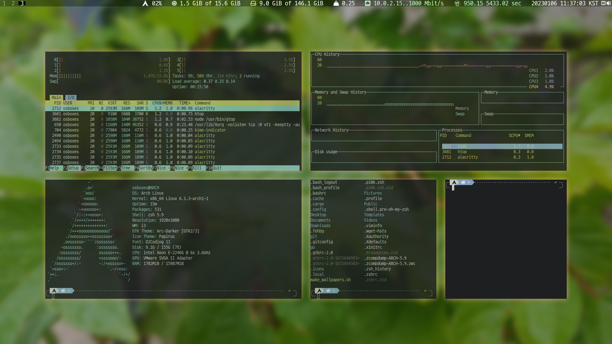

# MyArchLinux

_Setting Recipe & Dotfiles_

[](https://youtu.be/AcF2DZhG3-0)

## Set Virtualbox
* Use Intel HD Audio
* Use efi
* Boot and choose menu
```
Arch Linux install medium (x86_64, UEFI)
```

## pre-install
### Check network
```
ping google.com
```
### Make partitions & mount
```
lsblk
cfdisk
# make boot partition with 1GB & EFI System type ( /dev/sda1 )
# make root partition ( /dev/sda2 )
mkfs.fat -F32 /dev/sda1
mkfs.ext4 /dev/sda2
# mounting
mount /dev/sda2 /mnt
mkdir -p /mnt/boot/efi
mount /dev/sda1 /mnt/boot
```
### etc
```
pacstrap /mnt base base-devel linux linux-firmware vim nano
genfstab -U /mnt >> /mnt/etc/fstab
cat /mnt/etc/fstab
arch-chroot /mnt
```

## root
### locale
```
ln -sf /usr/share/zoneinfo/Asia/Seoul
hwclock --systohc
mv /etc/locale.gen /etc/locale.gen.old
echo en_US.UTF-8 UTF-8 > /etc/locale.gen
locale-gen
echo LANG=en_US.UTF-8 > /etc/locale.conf
echo LANGUAGE=en_US >> /etc/locale.conf
echo LC_ALL=C >> /etc/locale.conf
echo KEYMAP=us >> /etc/vconsole.conf
```
### hostname & root pw
```
echo "arch" > /etc/hostname
passwd
```
### bootloader
```
pacman -S grub efibootmgr dosfstools openssh os-prober mtools
exit
umount /dev/sda1
mount /dev/sda1 /mnt/boot/efi
arch-chroot /mnt
grub-install /dev/sda
grub-mkconfig -o /boot/grub/grub.cfg
bootctl install
```
### arch.conf
```
blkid
# memo PARTUUID ...
echo title Arch Linux > /boot/efi/loader/entries/arch.conf
echo linux /vmlinuz-linux >> /boot/efi/loader/entries/arch.conf
echo initrd /initramfs-linux.img >> /boot/efi/loader/entries/arch.conf
echo options root=PARTUUID=... quiet loglevel=3 rw >> /boot/efi/loader/entries/arch.conf
```
### network
```
pacman -S dhcpcd networkmanager network-manager-applet
systemctl enable dhcpcd.service
systemctl enable NetworkManager.service
echo 127.0.0.1    localhost.localdomain   localhost >> /etc/hosts
echo ::1          localhost.localdomain   localhost >> /etc/hosts
echo 127.0.0.1    arch.localdomain    arch >> /etc/hosts
```
### reboot
```
exit
umount -a
reboot
```

## user : osboxes
### adduser in root
```
pacman -S sudo
useradd -m osboxes
passwd osboxes
cp /etc/sudoers /etc/sudoers.old
echo osboxes ALL=(ALL:ALL) ALL >> /etc/sudoers
exit
```
### login osboxes
```
sudo mv /etc/pacman.conf /etc/pacman.conf.old
sudo echo color >> /etc/pacman.conf
sudo pacman -S iw wpa_supplicant dialog intel-ucode git reflector lshw unzip micro figlet screenfetch hwinfo
sudo pacman -S wget pulseaudio alsa-utils alsa-plugins pavucontrol pasystray xdg-user-dirs
sudo pacman -S gtop htop file-roller imagemagick
sudo pacman -S xorg-server xorg-apps xorg-xinit
sudo pacman -S i3-gaps i3blocks i3status i3lock numlockx xclip xterm alacritty feh scrot rofi firefox vlc picom
sudo pacman -S lxappearance
sudo pacman -S papirus-icon-theme
sudo pacman -S arc-gtk-theme
sudo pacman -S noto-fonts-cjk
sudo pacman -Syu
reboot
startx
```

## start i3
### default terminal
```
cd ~
echo export TERMINAL=/usr/bin/alacritty >> ~/.profile
```
### yay
```
mkdir ~/git
cd git
git clone https://aur.archlinux.org/yay-git.git
chmod 777 ./yay-git
cd yay-git
makepkg -si
# Multicore Build
sudo micro /etc/makepkg.conf
# MAKEFLAGS="-j$(nproc)"
```
### yay pkg (example)
```
yay -S sampler
```
## kime
```
cd
yay -S kime
sudo micro /etc/environment
# export GTK_IM_MODULE=kime
# export QT_IM_MODULE=kime
# export XMODIFIERS=@im=kime
mkdir -p ~/.config/kime
cp /usr/share/doc/kime/default_config.yaml ~/.config/kime/config.yaml
micro ~/.config/kime/config.yaml
# Change shortcuts
kime-check
```
### Font : D2Coding
```
sudo wget -O /usr/share/fonts/truetype/D2Coding.zip https://github.com/naver/d2codingfont/releases/download/VER1.3.2/D2Coding-Ver1.3.2-20180524.zip
sudo unzip /usr/share/fonts/truetype/D2Coding.zip -d /usr/share/fonts/truetype/
sudo rm /usr/share/fonts/truetype/D2Coding.zip
```
### Font : D2Coding Nerd Font
```
sudo mkdir -p /usr/share/fonts/truetype/D2CodingNerd
sudo wget -O /usr/share/fonts/truetype/D2CodingNerd/D2CodingNerd.ttf https://github.com/kelvinks/D2Coding_Nerd/raw/master/D2Coding%20v.1.3.2%20Nerd%20Font%20Complete.ttf
sudo fc-cache -f -v
```
### Font : Eulyoo1945
```
cd
wget -O Eulyoo1945.zip http://www.eulyoo.co.kr/board/down.php\?file_name\=eulyoo1945font.zip\&file_save_name\=eulyoo1945font.zip
unzip Eulyoo1945.zip
sudo mkdir -p /usr/share/fonts/opentype/Eulyoo1945
sudo mv ./Eulyoo_font_201204/Eulyoo1945-Regular.otf /usr/share/fonts/opentype/Eulyoo1945/Eulyoo1945-Regular.otf
sudo mv ./Eulyoo_font_201204/Eulyoo1945-SemiBold.otf /usr/share/fonts/opentype/Eulyoo1945/Eulyoo1945-SemiBold.otf
rm Eulyoo1945.zip
rm -rf Eulyoo_font_201204
rm -rf __MACOSX

sudo fc-cache -f -v
```
### zsh, oh-my-zsh
```
sudo pacman -S zsh
chsh -s `which zsh`
curl -L https://raw.github.com/robbyrussell/oh-my-zsh/master/tools/install.sh | sh
git clone https://github.com/romkatv/powerlevel10k.git $HOME/.oh-my-zsh/custom/themes/powerlevel10k
sudo rboot now
# p10k configure
```
### copy dotfiles
```
cd git
git clone https://github.com/dymaxionkim/MyArchLinux.git

mv $HOME/.zshrc $HOME/.zshrc.old
cp $HOME/git/MyArchLinux/_zshrc $HOME/.zshrc

mv $HOME/.p10k.zsh $HOME/.p10k.zsh.old
cp $HOME/git/MyArchLinux/_p10k.zsh $HOME/.p10k.zsh

mv $HOME/.config/alacritty $HOME/.config/alacritty.old
cp -r $HOME/git/MyArchLinux/_config/alacritty/ $HOME/.config/alacritty/

mv $HOME/.config/i3 $HOME/.config/i3.old
cp -r $HOME/git/MyArchLinux/_config/i3/ $HOME/.config/i3/

mv $HOME/.config/i3status $HOME/.config/i3status.old
cp -r $HOME/git/MyArchLinux/_config/i3status/ $HOME/.config/i3status/

mv $HOME/.config/kime $HOME/.config/kime.old
cp -r $HOME/git/MyArchLinux/_config/kime/ $HOME/.config/kime/

mv $HOME/.config/picom $HOME/.config/picom.old
cp -r $HOME/git/MyArchLinux/_config/picom/ $HOME/.config/picom/

mv $HOME/Pictures/Wallpaper $HOME/Pictures/Wallpaper.old
cp -r $HOME/git/MyArchLinux/Wallpaper $HOME/Pictures/

cd
reboot
```
### automount
```
sudo pacman -S udisks2 udiskie
sudo systemctl enable udisks2
```
### git
```
git config --global user.email "...@gmail.com"
git config --global user.name "..."
git config --global color.ui auto
git config --global core.editor 'micro'
git config --global credential.helper cache
git config --global push.default matching
```

### Themes (option)
```
yay -S yaru-icon-theme
yay -S yaru-gtk-theme
```

### cli-visualizer
```
yay -S cli-visualizer
mv $HOME/.config/vis $HOME/.config/vis.old
cp -r $HOME/git/MyArchLinux/_config/vis/ $HOME/.config/vis/
vis
```

### cron & wallpaper
```
sudo pacman -S cronie
sudo systemctl enable cronie.service --now
crontab -e
# */1 * * * * DISPLAY=:0.0 /usr/bin/feh --randomize --bg-fill /home/osboxes/Pictures/Wallpaper/*
crontab -l
```

### Utils
```
yay -S btop cowsay cmatrix aafire neofetch pydf gcalcli logo-ls
yay -S inkscape gimp jre libreoffice mupdf code ffmpeg freecad ranger convertall julia
yay -S texlive-full pandoc
yay -S gmsh
```

### Pyenv
```
yay -S pyenv
pyenv install --list
pyenv install anaconda3-2022.10
pyenv global anaconda3-2022.10
conda update --all
```

### ElmerFEM
#### Common
```
cd ~/git
git clone https://github.com/ElmerCSC/elmerfem.git
sudo pacman -S base-devel cmake gcc-fortran openmpi openblas lapack
cd ~/git/elmerfem
mkdir build
cd build
```
#### Check with OpenMPI, without GUI
```
cmake .. -DWITH_OpenMP:BOOLEAN=TRUE -DWITH_MPI:BOOLEAN=TRUE
rm -rf *
```
#### Check with Netcdf, MUMPS
```
sudo pacman -S netcdf netcdf-fortran
yay -S metis parmetis scotch
pyenv versions
pyenv global system
yay -S mumps
pyenv global anaconda3-2022.10
pyenv versions
```
#### HYPRE
```
pyenv global system
yay -S hypre
pyenv global anaconda3-2022.10
pyenv versions
```
#### cmake with GUI
```
yay -S qt5 qwt
cmake .. -DWITH_OpenMP:BOOLEAN=TRUE -DWITH_MPI:BOOLEAN=TRUE -DWITH_ELMERGUI:BOOLEAN=TRUE
```
#### Compile & Install
```
make -j8
sudo make install
ls /usr/local/bin/Elmer*
```

### Paraview
* download : [Praview](https://www.paraview.org/download/)
* Extract in `~/.Paraview`
* pre-requisite before run :
```
sudo pacman -S libxcrypt-compat
```
* Run : `paraview`

### Salome Platform
* Download : [SalomePlatform](https://www.salome-platform.org/?page_id=15)
* Extract in `~/.Salome`
* Salome 9.9 : Not working explode command (no solution yet)
* Run : `salome`

### CalCuliX
```
yay -S calculix-ccx calculix-cgx
```

### CalCuliX Launcher
* Download : [CalCuliX Launcher](http://www.calculixforwin.com/)
* Extract in `~/.CalculixLauncher`
* Multicore :
```
cp ~/git/MyArchLinux/_pam_environment ~/.pam_environment
micro ~/.pam_environment
```
* Run : `CL`

### calculix/cae
* Download : [Releases](https://github.com/calculix/cae/releases)
* Extract in `~/.cae`
* pre-requisite before run :
```
pyenv global system
sudo pip install xlib PyQt5 PyQtWebengine
pyenv global anaconda3-2022.10
```
* Run :
```
pyenv global system
cae
pyenv global anaconda3-2022.10
```

### VirtualBox Guest Utils
* Install
```
sudo pacman -S virtualbox-guest-utils
```
* Start Service
```
sudo systemctl enable vboxservice.service
```
* User Group for Permission
```
sudo usermod -G vboxsf -a $USER
sudo reboot now
```
* Link Shared Directory
```
ln -s /media/sf_D_DRIVE ~/D_DRIVE
```

### Disable Audio Power Saving for better sound (when using VirtualBox Intel HD Audio)
```
sudo micro /etc/modprobe.d/Audio.sh
# options snd_hda_intel power_save=0 power_save_controller=N
```

# Fin
